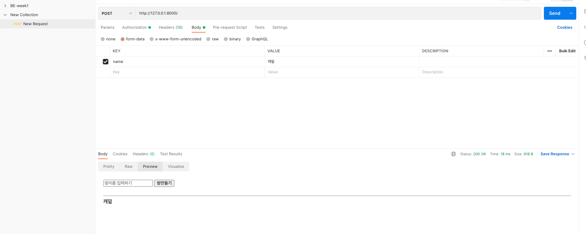
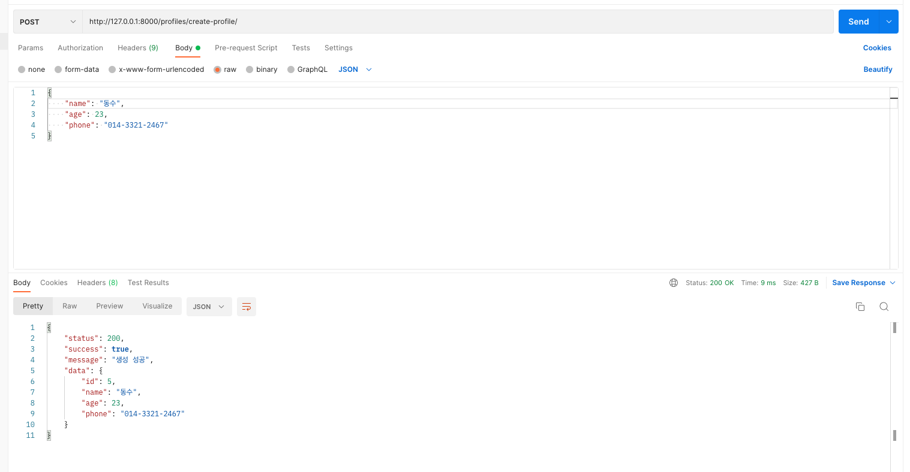
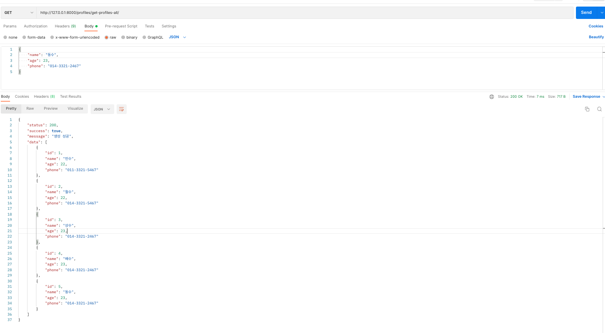
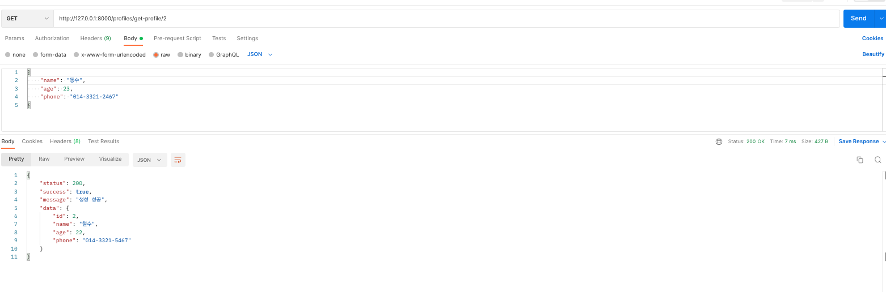
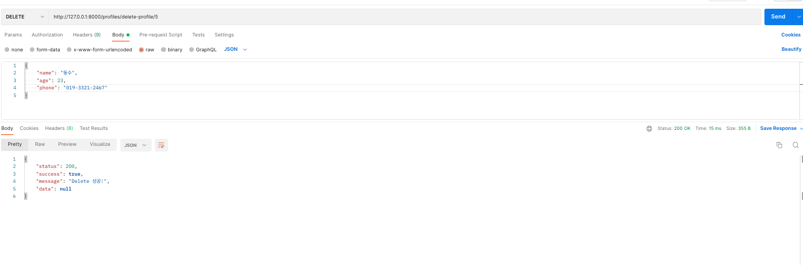
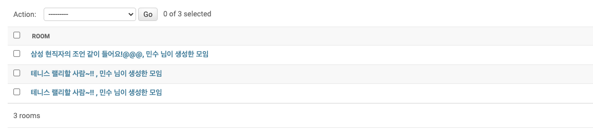
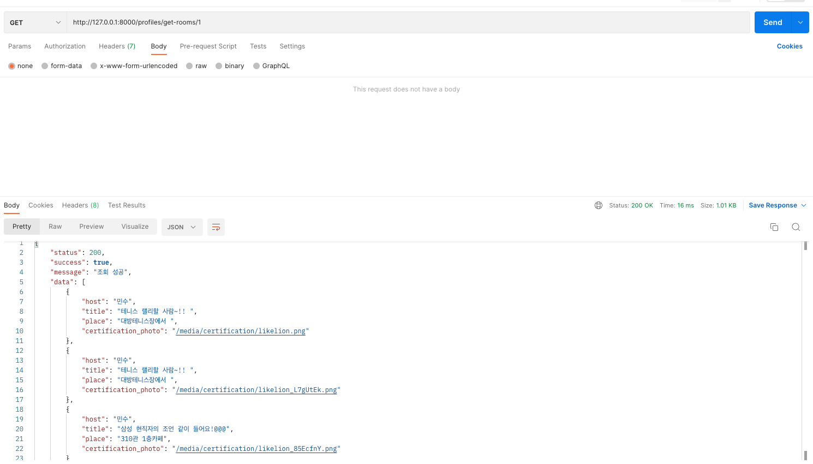

### BE-week1

### BE-week2

###### Create-profile

###### Read-profiles-all

###### Read-profile

###### Update-profile

###### Delete-profile

### BE-week3

###### create-room

###### 1:N 관계 모델 생성 ; 사용자(Profile)가 모임 생성(Room)

###### get-rooms

###### 사용자 id값으로 필터링해서 해당 id값을 가지는 사용자(Profile)가 생성한 모임 객체들(Room) 가져오는 함수

